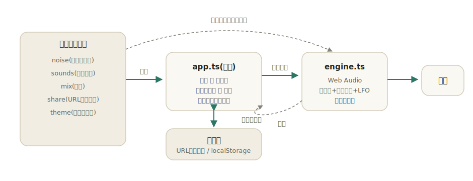

# amaoto

[](https://github.com/miruky/amaoto/actions/workflows/ci.yml)
[](https://github.com/miruky/amaoto/actions/workflows/deploy.yml)

[](LICENSE)

**雨・波・風・焚き火などの環境音をブラウザの中だけで合成し、好きに重ねて作業や休息のための音の場を作るミキサー。**

公開ページ: https://miruky.github.io/amaoto/

## 概要

amaotoは8種類の環境音（雨、波、風、焚き火、小川、ホワイト・ピンク・ブラウンの各ノイズ）を個別に鳴らし、それぞれの音量を混ぜて好みの背景音を作るツールである。音声ファイルは一切持たず、すべてWeb Audioでその場から合成する。雨はピンクノイズを高域寄りに、波はブラウンノイズをゆっくり寄せては返すように、焚き火は低い唸りに不規則な爆ぜ音を重ねて作る、というように、色付きノイズにフィルタとゆらぎを与えて質感を出している。

各音はカードになっていて、押せば鳴り、スライダーで音量を決める。複数を重ねられるので、雨に遠くの風を少し足す、焚き火に小川を添える、といった調合ができる。作った状態にはシーンとして名前のついた出発点（雨の書斎、海辺、焚き火の夜など）も用意した。一定時間で静かに消えるスリープタイマーがあり、就寝時はゆっくりフェイドアウトして止まる。

調合した音はURLのハッシュに畳まれる。リンクをコピーして渡せば、開いた相手の画面に同じ混ぜ具合が復元される。最後の状態はこの端末のブラウザにも残り、次に開いたときに戻る。サーバーへは何も送らない。

Web Audioは利用者の操作を機にしか音を出せないため、最初にカードへ触れた時点で発音が始まる。

### なぜ作ったのか

作業用の環境音サービスは多いが、たいてい音声ファイルを配信していて、再生の前に読み込みを待ち、回線がなければ鳴らない。環境音の多くはノイズを加工すれば作れるので、ファイルを持たずにブラウザだけで合成すれば、開いた瞬間から鳴り、オフラインでも動き、容量もごく小さくなる。混ぜ具合をリンクで共有でき、就寝用に静かに消える、その場で完結する小さなミキサーが欲しかった。発音はWeb Audioの標準ノードに任せ、音の設計と混ぜ方に集中している。

## アーキテクチャ



色付きノイズの生成、音源の定義、ミックスの状態、URL共有は、Web Audioに触れない純粋関数として`src/lib`に置く。ノイズはシード付きの擬似乱数で決定的に作るため、質感（白色・ピンク・ブラウンで高域の落ち方が変わること）をテストで確かめられる。画面（`app.ts`）はミックスを操作し、発音エンジン（`engine.ts`）が各レイヤをループ再生のノイズ＋フィルタ＋LFOで組み立て、マスターのコンプレッサを通して出力する。ミックスはURLハッシュとlocalStorageへ保存し、起動時に復元する。

## 技術スタック

| カテゴリ             | 技術                          |
| :------------------- | :---------------------------- |
| 言語                 | TypeScript 5（strict）        |
| 音声                 | Web Audio API                 |
| ビルド               | Vite 6                        |
| テスト               | Vitest（happy-domでDOMも検証）|
| リンタ・フォーマッタ | ESLint 9 / Prettier           |
| CI / 配信            | GitHub Actions / GitHub Pages |
| 永続化               | URLハッシュ / localStorage    |

## 使い方

### 音を重ねる

カードを押すと鳴り、もう一度押すと止まる。スライダーで音量を決める。スライダーを動かすと、止まっていた音も鳴り始める。数字キー（1〜8）でも対応する音をオンオフできる。

| 音       | 作り方の概略                                       |
| :------- | :------------------------------------------------- |
| 雨       | ピンクノイズを高域寄りにし、ゆっくり音量を揺らす   |
| 波       | ブラウンノイズの遮断周波数を低周期で寄せ返す       |
| 風       | ピンクノイズの帯域を周期的に動かす                 |
| 焚き火   | 低い唸りに、不規則な間隔の爆ぜ音を重ねる           |
| 小川     | ホワイトノイズを高域寄りにし、細かく揺らす         |
| 各ノイズ | 白色・ピンク・ブラウンの色そのままを集中用に       |

### 全体の操作

| 操作         | 内容                                             |
| :----------- | :----------------------------------------------- |
| マスター音量 | 全体の音量                                       |
| シーン       | 雨の書斎・海辺・焚き火の夜・渓流・嵐・集中        |
| ランダム     | シーンを無作為に選ぶ                             |
| すべて止める | 鳴っている音を一度に止める（音量は保つ）         |
| スリープ     | 15〜60分後に8秒かけて消音し、再生を止める        |

### 共有と保存

「リンクをコピー」を押すと、いま鳴っている混ぜ具合を載せたURLがクリップボードに入る。たとえば次のように畳まれる。

```
https://miruky.github.io/amaoto/#m=1|80|rain:55,brown:25
```

このリンクを開くと同じミックスが復元される。明示的に保存しなくても、最後の状態はブラウザに残る。

## プロジェクト構成

- `index.html` — エントリポイント
- `src/main.ts` — 起動。`#app`へ画面を取り付ける
- `src/app.ts` — カード・シーン・タイマー・共有の画面と状態管理
- `src/icons.ts` — 線画のSVGアイコン
- `src/style.css` — デザイントークンとスタイル（ライト・ダーク対応）
- `src/lib/noise.ts` — シード付きの色付きノイズ生成
- `src/lib/sounds.ts` — 各環境音の合成パラメータの定義
- `src/lib/mix.ts` — ミックスの状態・編集・シーン
- `src/lib/share.ts` — ミックスとURL文字列の相互変換
- `src/lib/storage.ts` — localStorageの薄いラッパ
- `src/lib/engine.ts` — Web Audioによる合成と再生
- `docs/architecture.svg` — 構成図
- `.github/workflows/` — CI（lint・テスト・ビルド）とPagesデプロイ

## はじめ方

### 前提条件

- Node.js 22以上

### セットアップ

```bash
git clone https://github.com/miruky/amaoto.git
cd amaoto
npm install
npm run dev
```

### テストの実行

```bash
npm test
```

### Lintの実行

```bash
npm run lint
```

### ビルド

```bash
npm run build
```

GitHub Pagesではリポジトリ名のサブパスで配信されるため、デプロイ時は環境変数 `AMAOTO_BASE=/amaoto/` でViteの `base` を切り替える（`.github/workflows/deploy.yml` 参照）。

## 設計方針

- **ファイルを持たず合成する** — 環境音は色付きノイズの加工で作り、音声ファイルを配信しない。開いた瞬間に鳴り、オフラインでも動き、配信物はごく小さい。
- **音の規則を純粋関数に置く** — ノイズ生成と音源の定義、ミックスの状態はWeb Audioから切り離す。決定的に作るノイズは質感をテストでき、発音は同じ定義から組み上がる。
- **状態は1つのミックス** — 操作も共有も保存も、単一のミックスを作り直して差し替えるだけで扱う。URLとlocalStorageはその文字列表現を持つ。
- **壊れた入力を黙って捨てる** — 共有URLは厳密に検証し、未知の音源や範囲外の値は復元せず既定へ戻す。発音できない環境でも画面は動く。
- **休息に寄り添う** — スリープタイマーは唐突に切らず、数秒かけて静かに消す。動きは鳴っている音のレベル表示だけにとどめ、`prefers-reduced-motion` で無効化する。

## ライセンス

[MIT](LICENSE)
